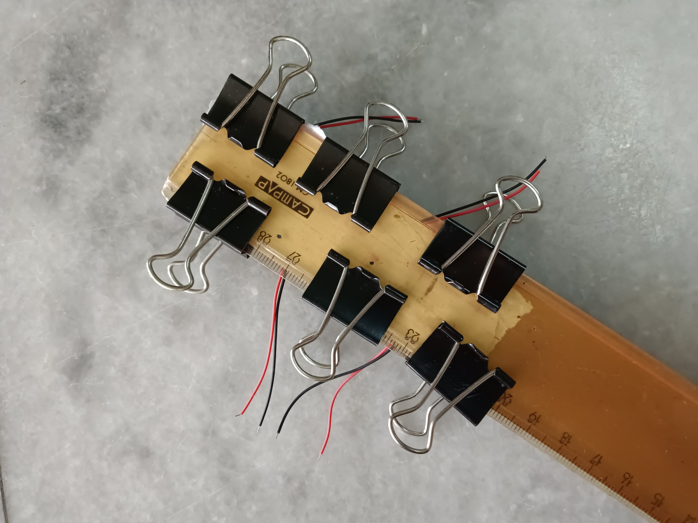
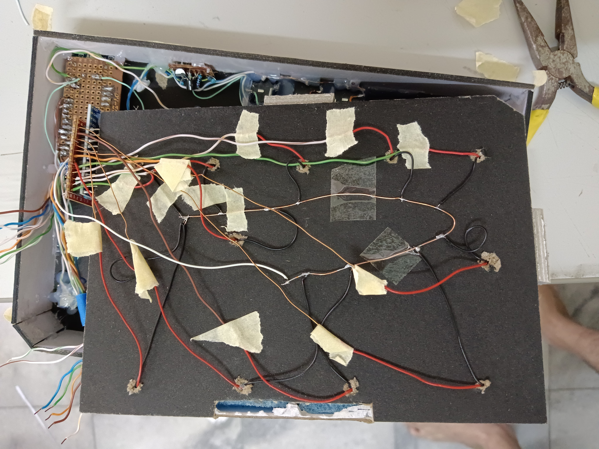

# ZYDP miniPad - Hardware
This branch contains all the hardware designs (3D models, drawing and electrical schematic diagram) and images taken during the construction of the project. Unlike the software part, the organisation and documentation is much more messy.

## Files in the branch
1. `cad_model` folder contains all the 3D models in FreeCAD format and technical drawing in pdf of the project
1. `schematic` folder contains the electrical schematic in pdf and KiCAD files for the schematic and simulation
1. `images` folder contains images taken during the course of the project
1. `operation_guide` is a user manual for this project
1. `project_diaries` is a log of information throughout the project
1. `resources` is originally intended to be a place to keep all the links to the useful resources, but ended up being a log for setting up the bootloader

## Bill of materials

| **Item**                            | **Unit price** | **Qty** | **Cost** |
|-------------------------------------|----------------|---------|----------|
| **Electronics**                     |                |         |          |
| Bluepill STM32F103C8T6              | 7.4            | 1       | 7.4      |
| Multiplexer 74HC4067                | 2.25           | 1       | 2.25     |
| 3.5mm Jack                          | 0.365          | 4       | 1.46     |
| Buttons                             | 0.0418         | 7       | 0.2926   |
| RGB LED common cathode              | 0.13           | 1       | 0.13     |
| Ethernet cable for single core wire | 1.5            | 0.5     | 0.75     |
| NPN transistors 2SC1815             | 0.0496         | 2       | 0.0992   |
| Resistors (estimate price)          | 0.016          | 21      | 0.336    |
| Prototyping board                   | 0.502          | 1       | 0.502    |
| Piezo elements                      | 0.3055         | 13      | 3.9715   |
|                                     |
| **Mechanical**                      |                |         |          |
| Sponge                              | 2.3            | 0.25    | 0.575    |
| EVA foam                            | 1.3            | 1       | 1.3      |
| Spray paint                         | 6.5            | 0.5     | 3.25     |
| Spray lacquer                       | 6.5            | 0.5     | 3.25     |
| Rubber feet                         | 0.104          | 6       | 0.624    |
| Mounting board                      | 3.5            | 1       | 3.5      |
|                                     |                |         |          |
|                                     |                |Total (RM)| 29.6903  |

## Image gallery

### Finished project
TBA

### During the making of the project

#### The pads

*Surface preparation of the discs and aluminum sheet cut from drinks can*

*Applied epoxy glue at the back*

*Glued and clamped*

The layering of the disc and the aluminum sheet is to increase the area that the pad is sensitive to. Without it, it is required to hit dead center to register anything. While this does improve the problem significantly, I still do not consider it to be good enough and yet to be improved.

*EVA foam and mounting board cut to size*

*The "aluminum-disc composite" glued on the EVA foam. This is followed by another layer of EVA foam glued on top (not shown in image)*

*Clamping while the glue cure*

*Finished pads*

#### The pads holder

*The bottom part of the pad holder*

*Now with separation between pads*

*Filling with sponge*

*Aligning the pads*

*Pads glued on top with wires passing through the bottom*

#### Buttons

*The 5 coloured buttons. The side is coloured using poster colour and the top is spray painted black. Then lacquer spray is applied over entire thing*

*The platform that will hold the push buttons. The LED is wired together.*

*Buttons ready to be glued*

#### Faceplate

*Freshly cut faceplate, those holes took forever to hand cut, I need a laser cutter. Other freshly cut parts are also shown in the images*

*Printed label is glued on top and sprayed painted over. The procedure is described in the `project_diaries` file*

#### Enclosure body

*Constructing the enclosure. Of course the "X" support cause the entire thing to be warped because it is not flat*

*Back panel mounted and the development board, TRS MIDI circuit and 3.5mm jack ~~installed~~ glued*

*Ahh I'm not proud of this wiring*

*Pad holder successfully installed*

*Mounting the LED with epoxy but failed, so hot glue it is*

*Installing the faceplate*

## License

The hardware and all the designs in this branch are licensed under [CERN Open Hardware Licence Version 2 - Weakly Reciprocal](LICENSE).

The images are licensed under [Creative Commons Attribution 4.0 International](CC-LICENSE).